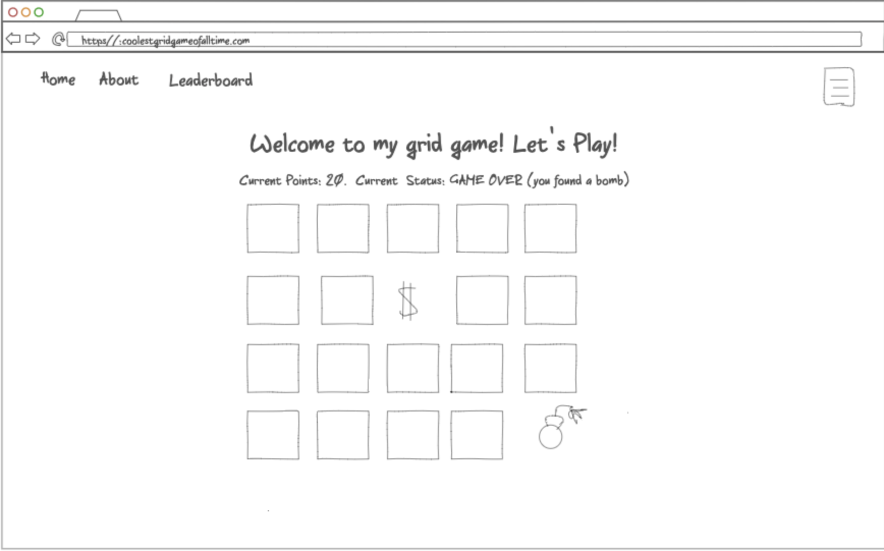

# My Startup -- Elevator Pitch
I have an idea for an online game! I got the inspiration from a game I remember playing as a kid. Basically, you have a grid of panels. Behind each panel is either a treasure chest or a landmine. Each time you flip one over and find treasure, your points double! You start with 1 point, and see how far you can make it. But, flip over a landmine, and it's game over! It's simple, and it plays into humans' propensity to gamble. It would provide a quick and easy thrill for when you had 5 minutes to kill. You would also be able to increase your starting bet as you collect more points, raising your potential to get tons more. 

## Design

## Technologies and Features My Online Game Will Employ

### Authentication:

In order to play, the user will have to create an account and login. They will need an account so that we can store the user's high scores and saved points. 

### Database Data:

As mentioned before, part of the fun of the game will be getting exponential increases in points. In order to save progress so that players wouldn't have to start over from one, the game will store the specific user's all-time points that they've saved up. There will also be a leaderboard of the highest point holders in the world. 

### Websocket Data:

Every time a user starts or ends a round, the leaderboard will update. Each user will be able to see their global ranking change after each round.

### Additional Technology Notes:

- **HTML** - I will use three precisely structured html pages. One for logging in, one for playing the game, and one to see the global leaderboard.
- **CSS** - Professional-looking styling to ensure that the site is playable and reachable on all screen sizes.
- **JavaScript** - Will provide the meat of the grid game. Panels will be interactive, like buttons.
- **React** - Application ported to use the React web framework.